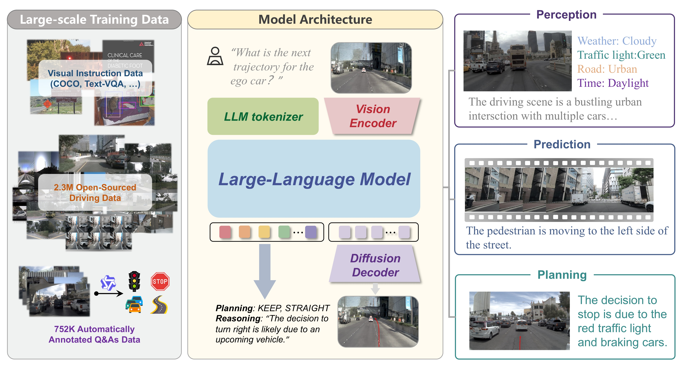

<div align="center">

<h1>ReCogDrive</h1>
<h3>A Reinforced Cognitive Framework for End-to-End Autonomous Driving</h3>

[Yongkang Li](https://owl-10.github.io/yongkangli/)<sup>1,2\*</sup>, Kaixin Xiong<sup>2\*</sup>, Xiangyu Guo<sup>1,2</sup>, Fang Li<sup>2</sup>, [Sixu Yan](https://sixu-yan.github.io/)<sup>1</sup>, [Gangwei Xu](https://gangweix.github.io/)<sup>1,2</sup>,  
Lijun Zhou<sup>2</sup>, [Long Chen](https://long.ooo/)<sup>2</sup>, Haiyang Sun<sup>2†</sup>, Bing Wang<sup>2</sup>, Guang Chen<sup>2</sup>,  
Hangjun Ye<sup>2</sup>, [Wenyu Liu](https://eic.hust.edu.cn/professor/liuwenyu/)<sup>1</sup>, [Xinggang Wang](https://xwcv.github.io/)<sup>1✉</sup>  

<sup>1</sup>Huazhong University of Science and Technology  
<sup>2</sup>Xiaomi EV  

(\*) Equal contribution. (†) Project leader. (✉) Corresponding author.  

Arxiv 2025

<a href="https://arxiv.org/abs/2506.08052"></a>   <a href="https://xiaomi-research.github.io/recogdrive/"></a> [](https://huggingface.co/owl10/ReCogDrive/tree/main)&nbsp;
</div>


</div>

## News
* **` Aug. 21th, 2025`:** We release the initial version of code and weight on NAVSIM, along with documentation and training/evaluation scripts. We will also update our new revision of the paper and the pretraining datasets later this month or next month. Please stay tuned! ☕️
* **` Jun. 11th, 2025`:** We released our paper on [Arxiv](https://arxiv.org/abs/2506.08052). Code/Models are coming soon. Please stay tuned! ☕️


## Updates
- [x] Release Paper  
- [x] Release Full Models and Training/Evaluation Framework   
- [ ] Release Full Driving QA Datasets
- [ ] Release updated paper 

## Table of Contents
- [Abstract](#Abstract)
- [Qualitative Results on NAVSIM Navtest](#qualitative-results-on-navsim-navtest)
- [Getting Started](#getting-started)
- [Contact](#contact)
- [Acknowledgement](#acknowledgement)
- [Citation](#citation)

## Abstract         

Although end-to-end autonomous driving has made remarkable progress, its performance degrades significantly in rare and long-tail scenarios. Recent approaches attempt to address this challenge by leveraging the rich world knowledge of Vision-Language Models (VLMs), but these methods suffer from several limitations: (1) a significant domain gap between the pre-training data of VLMs and real-world driving data, (2) a dimensionality mismatch between the discrete language space and the continuous action space, and (3) imitation learning tends to capture the average behavior present in the dataset, which may be suboptimal even dangerous. In this paper, we propose ReCogDrive, an autonomous driving system that integrates VLMs with diffusion planner, which adopts a three-stage paradigm for training. In the first stage, we use a large-scale driving question-answering datasets to train the VLMs, mitigating the domain discrepancy between generic content and real-world driving scenarios. In the second stage, we employ a diffusion-based planner to perform imitation learning, mapping representations from the latent language space to continuous driving actions. Finally, we fine-tune the diffusion planner using reinforcement learning with NAVSIM non-reactive simulator, enabling model to generate safer, more human-like driving trajectories. We evaluate our approach on the planning-oriented NAVSIM benchmark, achieving a PDMS of 90.2 and setting a new state-of-the-art that surpasses the previous vision-only SOTA by 6.2 PDMS.

<div align="center">

</div>


## Qualitative Results on NAVSIM Navtest 
<div align="center">
  
</div>
<p align="left">
  This visualization highlights ReCogDrive’s ability to generate smooth trajectories, accurate scene summaries, and clear driving instructions. 
  By identifying key objects such as vehicles and traffic signals, it achieves robust end-to-end autonomous driving with enhanced cognition.
</p>

## Getting Started

- [Download NAVSIM datasets following official instruction](https://github.com/autonomousvision/navsim/blob/main/docs/install.md)
- [Preparation of ReCogDrive environment](docs/Installation.md)
- [ReCogDrive Training and Evaluation](docs/Train_Eval.md)

## Checkpoint

> Results on NAVSIM


| Method | Model Size | Training Stage | PDMS | Weight Download |
| :---: | :---: | :---: | :---: |  :---: |
| ReCogDrive(VLM)-Base | 2B | Stage 1 | 84.8 | [Model](https://huggingface.co/owl10/ReCogDrive/tree/main/ReCogDrive_VLM_2B) | |
| ReCogDrive-Base | 2B + 35M | Stage 1&2&3| 90.3 | [Model](https://huggingface.co/owl10/ReCogDrive/tree/main/Diffusion_Planner_2B) | |
| ReCogDrive(VLM)-Large | 8B | Stage 1 | 86.8 | [Model](https://huggingface.co/owl10/ReCogDrive/tree/main/ReCogDrive_VLM_8B) | |
| ReCogDrive-Large | 8B + 35M | Stage 1&2&3| 90.5 | [Model](https://huggingface.co/owl10/ReCogDrive/tree/main/Diffusion_Planner_8B) | |

## Contact
If you have any questions, please contact [Yongkang Li](https://owl-10.github.io/yongkangli/) via email (liyk@hust.edu.cn) or wechat (liyk_0803).

## Acknowledgement
ReCogDrive is greatly inspired by the following outstanding contributions to the open-source community: [NAVSIM](https://github.com/autonomousvision/navsim), [DPPO](https://github.com/irom-princeton/dppo), [LightningDiT](https://github.com/hustvl/LightningDiT), [DiffusionDrive](https://github.com/hustvl/DiffusionDrive), [Senna](https://github.com/hustvl/Senna), [GR00T](https://github.com/NVIDIA/Isaac-GR00T).


## Citation
If you find ReCogDrive is useful in your research or applications, please consider giving us a star 🌟 and citing it by the following BibTeX entry.

```bibtex
@article{li2025recogdrive,
  title={ReCogDrive: A Reinforced Cognitive Framework for End-to-End Autonomous Driving},
  author={Li, Yongkang and Xiong, Kaixin and Guo, Xiangyu and Li, Fang and Yan, Sixu and Xu, Gangwei and Zhou, Lijun and Chen, Long and Sun, Haiyang and Wang, Bing and others},
  journal={arXiv preprint arXiv:2506.08052},
  year={2025}
}
```

